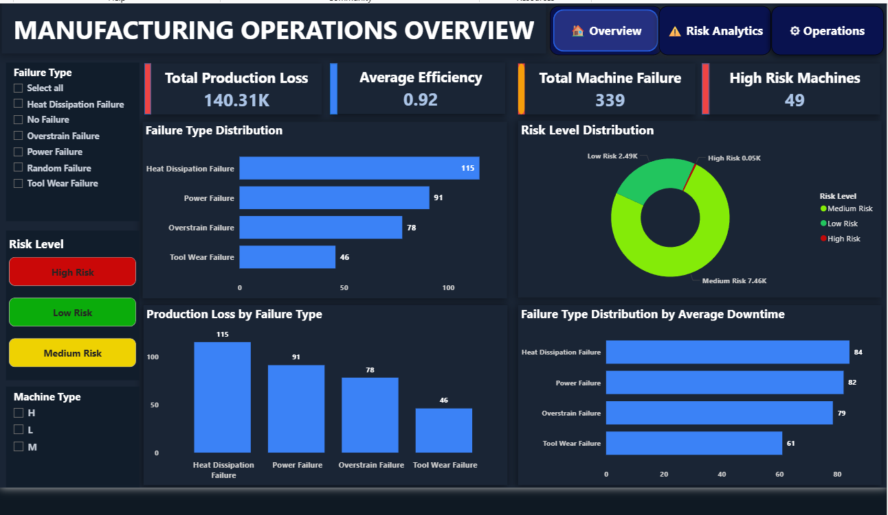
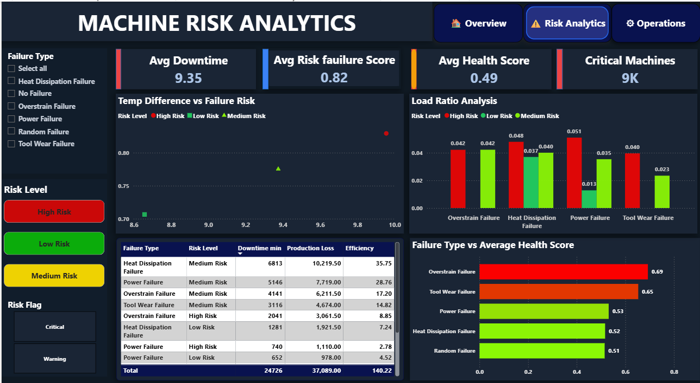
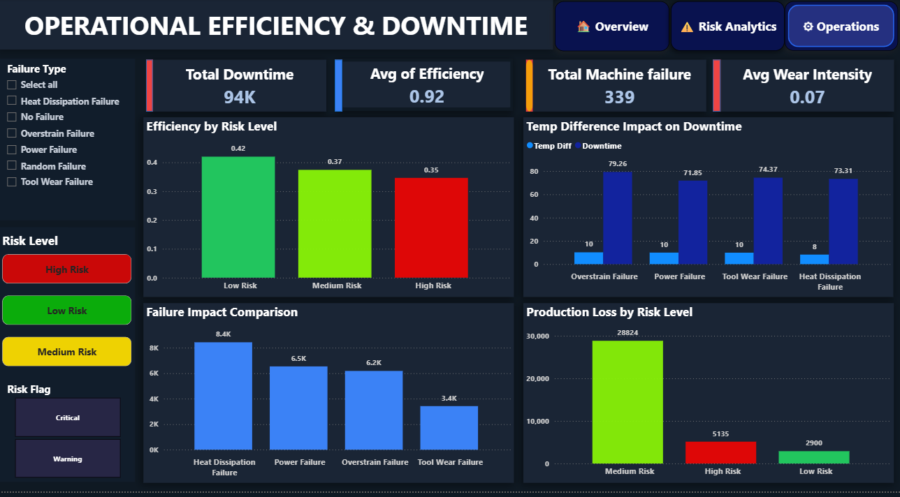

# Manufacturing Predictive Maintenance Analytics

## 📌 Project Overview

This project focuses on Predictive Maintenance Analytics in the Manufacturing Industry using Python, SQL, and Power BI.

The objective of this project is to analyze machine performance, identify failure patterns, evaluate operational efficiency, and monitor machine risk levels to reduce downtime and production losses.

---

# 🚀 Tools & Technologies Used

- Python (Pandas, NumPy, Matplotlib, Seaborn)
- Jupyter Notebook
- SQL (MySQL Workbench)
- Power BI
- Kaggle Predictive Maintenance Dataset

---

# 📊 Key Business Problems Solved

- Identify high-risk machines
- Analyze machine failure patterns
- Reduce production downtime
- Monitor operational efficiency
- Track production loss due to failures
- Improve predictive maintenance planning

---

# 📈 Dashboard Features

## Page 1 — Manufacturing Operations Overview
- Total Production Loss KPI
- Avg Efficiency KPI
- Machine Failure KPI
- High Risk Machine KPI
- Failure Type Distribution
- Risk Level Distribution
- Production Loss Analysis
- Downtime Analysis

---

## Page 2 — Machine Risk Analytics
- Failure Risk Analysis
- Load Ratio Analysis
- Avg Health Score Analysis
- Risk-Based Machine Monitoring
- Failure Type vs Health Score

---

## Page 3 — Operational Efficiency & Downtime
- Total Downtime Analysis
- Efficiency by Risk Level
- Wear Intensity Monitoring
- Downtime Trend Analysis

---

# 🧠 Python Work
- Data Cleaning
- Feature Engineering
- Failure Type Classification
- Risk Level Categorization
- Health Score Calculation
- Downtime & Production Loss Calculation

---

# 🗄️ SQL Analysis
- Failure Analysis Queries
- Risk-Level Based Analysis
- Downtime Aggregation
- Efficiency Analysis
- Production Loss Insights

---

# 📷 Dashboard Preview

## Manufacturing Operations Overview

## Machine Risk Analytics

## Operational Efficiency & Downtime

---

# 📌 Project Outcome

This project demonstrates how predictive maintenance analytics can help manufacturing industries reduce downtime, improve operational efficiency, and identify critical machine risks using data-driven decision-making.

---

# 👨‍💻 Author

Ankit Rai
